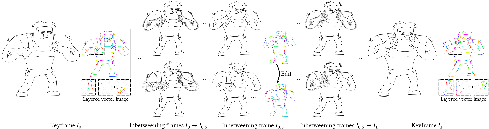
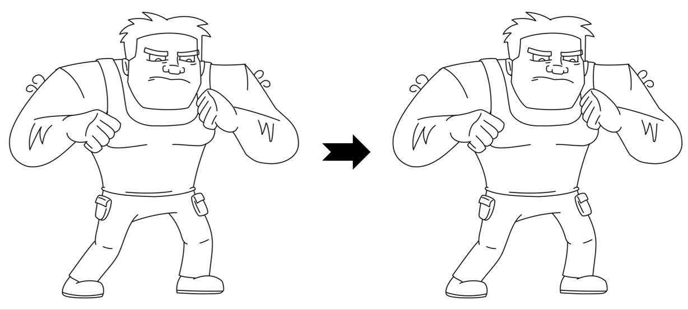
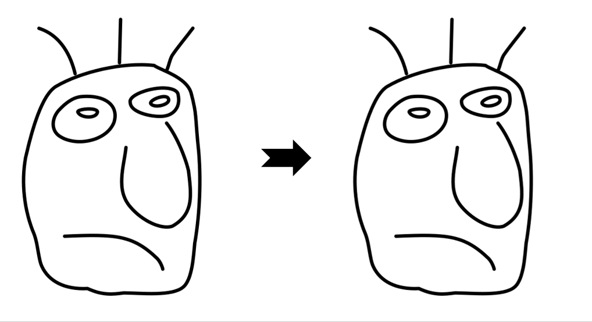

# LayerInbetween: Occlusion-Aware Stroke Correspondence and Inbetweening with Automatic Layering - SIGGRAPH 2026 (TOG)

[[Paper]](https://cislab.hkust-gz.edu.cn/media/documents/_SIGGRAPH_2026__LayerInbetween.pdf) | [[Project Page]](https://markmohr.github.io/LayerInbetween/)

This project can be used to produce **automatic inbetweening/2D animations** from clean line drawings, rough sketches, multi-character line art, complex scenes, abstract drawings, or multi-keyframe sequences.
Our vector-based approach can facilitate convenient **inbetweening editing**.



 &nbsp;&nbsp;&nbsp; 


## Environment

Create a Conda environment named `layerinbetween` and install the main dependencies from `requirements.txt`:

```bash
conda create -n layerinbetween python=3.10 -y
conda activate layerinbetween
pip install -r requirements.txt
```

If some packages are missing from `requirements.txt`, their exact versions can be found in `requirements-full.txt`.

To avoid environment conflicts with SAM2, create a separate Conda environment named `sam` and install SAM2 using its [instructions](https://github.com/facebookresearch/sam2#installation).


## Getting Started

### Download Checkpoints

Our project relies on external models, including [optical flow estimation](https://github.com/lisiyao21/AnimeRun/tree/main/flow), [depth estimation](https://github.com/DepthAnything/Depth-Anything-V2), and [SAM2 video tracking](https://github.com/facebookresearch/sam2). Please download the corresponding models and place them according to the following file structure.
Our models can be downloaded [here](https://drive.google.com/file/d/1QKdDZc5uaYRXFBYIThIEF4vU1SmGrsWU/view?usp=sharing).

```
optical_flow/
  AnimeRun/
    checkpoints/
      20000_gma-animerun-v2-ft.pth
      20000_raft-animerun-v2-ft_again.pth

depth_estimation/
  Depth-Anything-V2/
    checkpoints/
      depth_anything_v2_vitl.pth

video_tracking/
  sam2/
    models/
      SAM2.1/
        sam2.1_hiera_large.pt

outputs/
  ctrlpoint/
    snapshot/
      FAD3-CP46-sep-dist/
        sketch_ctrlpoint_30000.pkl
  endpoint/
    snapshot/
      FAD3-EPO35-1.5x-min=64/
        sketch_endpoint_30000.pkl
  transform/
    snapshot/
      FAD3-T12-2.0x-51-min=64/
        sketch_transform_30000.pkl
      FAD3-T13-2.0x-51/
        sketch_transform_local_30000.pkl

vgg_utils/
  quickdraw-perceptual.pth
```

### Input Preparation

Prepare raster keyframes and the vector image for the first keyframe (following the tutorial [here](https://github.com/MarkMoHR/JoSTC/blob/main/tutorials/Krita_vector_generation.md) to create SVGs). Then, place them to `test_examples/raster_black/` and `test_examples/svg/` folders.

Please name them to `X_ref.png`, `X_tar.png`, and `X.svg` using the same index `X`. 

### Step 1: Forward Prediction

Go to [configs/example_configs.py](configs/example_configs.py), and set the `test_img_id` to `X`. If you want to use the provided cases directly, please set the `test_img_id` to the corresponding image index. Then, run the following command:

```bash
sh run_forward.sh
```

This script includes several sub-processes. Refer to it for details. Finally, the output results of vector stroke correspondence are placed in `outputs/stroke_correspondence_results` folder.

### TODOs

- [ ] Backward prediction
- [ ] Occlusion resolving after interpolation
- [ ] Multi-frame prediction


