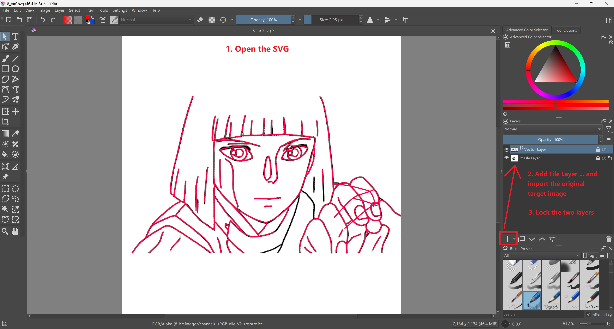
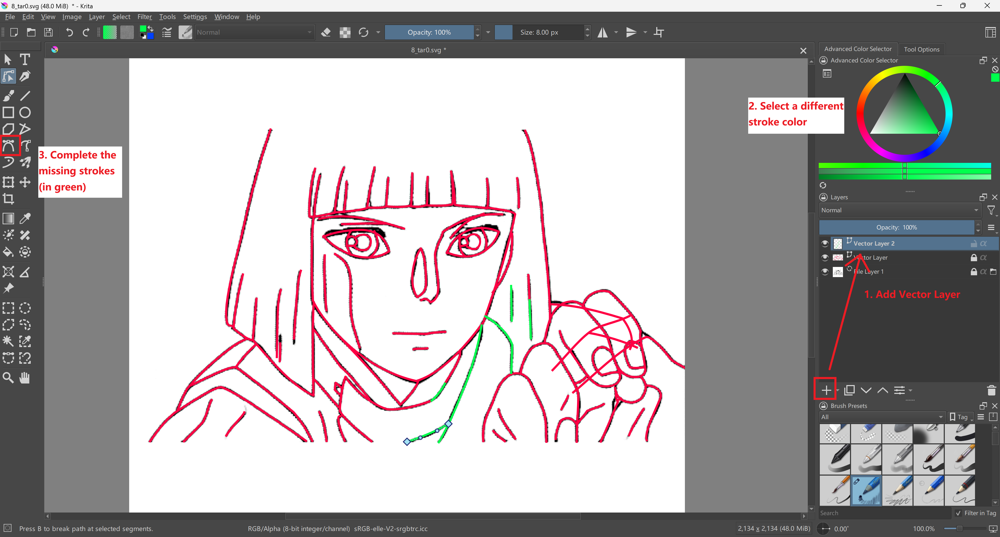
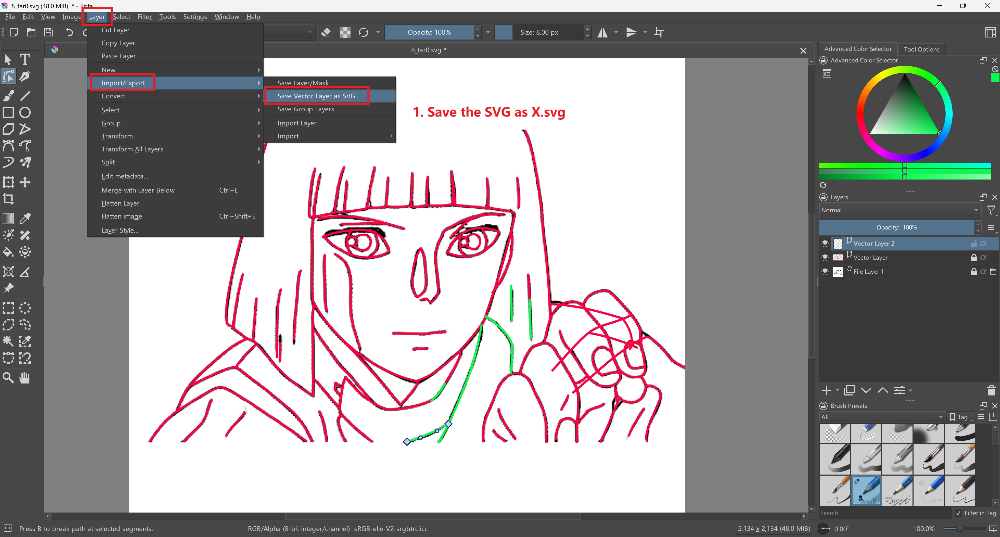

# Make Complementary Vector Strokes with Krita

1. Make sure you have installed [Krita](https://krita.org/en/)
2. Open the `X_tar0.svg` and load the original target keyframe:

3. Trace the missing strokes. Select a different color to distinguish the new strokes from the previous ones.

4. After tracing all the missing strokes, save it to an svg file: Layer - Import/Export - Save Vector Layer as SVG. Done!

